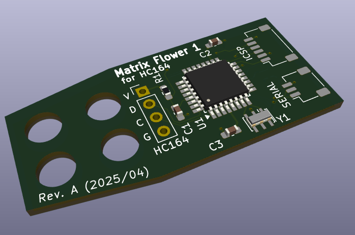
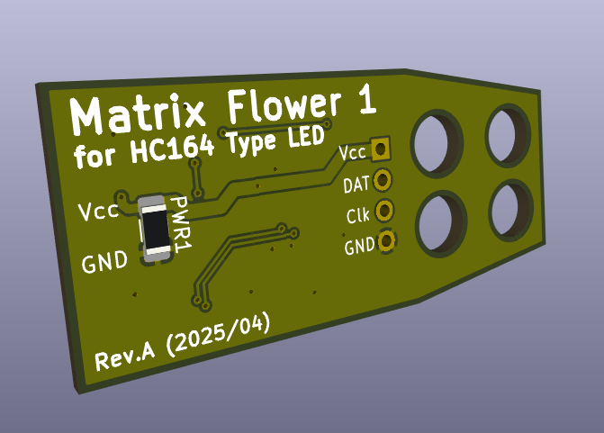

# matrix-flowers
Electronic art project. Vase of flowers made with seven segment LED modules.

* Matrix Flower 1
A flower made with module found on Amazon. See my proof of concept project
for the 74HC164 based module on Arduino at:
https://github.com/CircuitMonkey/hc164-2x4-led-segment-module

This flower project builds upon the proof-of-concept by making a custom
barebones Arduino PCB using the ATmega328P and allows direct soldering of the
LED modulel to that board. The board also provides mechanical mounting of a
fabricated flower stem that facilitates DC power to the module from the bottom
of the powered vase.
